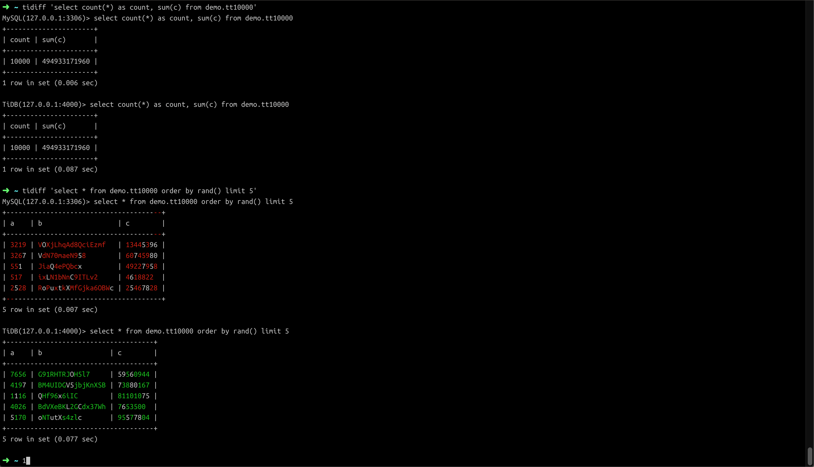

# tidiff

A tool to compare the result set difference of the same query in TiDB/MySQL

- Command Line Mode

    DEMO
    
    ```sh
    tidiff 'create database demo charset utf8mb4 collate utf8mb4_general_ci'
    tidiff 'create table demo.tt10000 (a bigint(20) not null auto_increment primary key, b varchar(20) not null, c bigint(20))'
    # OR
    # tidiff --mysql.db demo --tidb.db demo 'create table tt10000 (a bigint(20) not null auto_increment primary key, b varchar(20) not null, c bigint(20))'
    tidiff '! {{$count:=count 10000}} insert into demo.tt10000 values {{range $index := $count}} (NULL, "{{varchar 20}}", "{{int 100000 100000000}}"){{if head $index $count}},{{end}}{{end}}'
    tidiff 'select count(*) as count, sum(c) from demo.tt10000'
    tidiff 'select * from demo.tt10000 order by rand() limit 5'
    ```

    The results of above commands
    
    

    You can use the command line mode as downstream pipeline, e.g: `randgen | xargs tididff`. The SQL statement should be quote with `'` instead of `"`.

- UI Mode Shortcuts
    
    - `TAB` switch focus in different panel
    - `ESC` focus on SQL input panel
    - `UP`  focus on the previous history item
    - `DOWN` focus on the next history item
    - `ENTER` select current selected history item
    
    

## Features

- Record the histories
- Highlight the diff in result sets
- Support `!` directive, which enable the template support for a query, e.g:

    `! {{$count:=count 10}} insert into t values {{range $index := $count}}({{int 10 100}}){{if head $index $count}},{{end}}{{end}}`
    `!! select period_add({{ int 10000 200000}}, {{int 100 10000}})` will show the generated sql, e.g: `period_add(108081, 7987)`
    
- Template functions

    - `count n` returns a slice contains `n` elements
    - `first index slice` returns true if `index` is the first element of the `slice`
    - `last index slice`returns true if `index` is the last element of the `slice`
    - `head index slice`returns true if `index` is the head element of the `slice`
    - `tail index slice`returns true if `index` is the tail element of the `slice`
    - `int min max`returns a rand integer which in the range `[min, max)`
    - `char length`returns a rand string which length is `length`
    - `varchar length`returns a rand string which length in `[length/2, length)`
    
## Examples

1. `create table ttt(a bigint(20) not null auto_increment primary key, b bigint(20), c varchar(10))`
2. `! {{$count:=count 20}} insert into ttt values {{range $index := $count}} (NULL, '{{int 10 100}}', '{{varchar 10}}'){{if head $index $count}},{{end}}{{end}}`

## Config file

You can provide default values from config file `~/.config/tidiff/config`

```
mysql.host = 192.168.4.30
mysql.port = 3306
mysql.user = root
mysql.password = 12345678
mysql.db = test
mysql.options = charset=utf8mb4
tidb.host = 192.168.4.31
tidb.port = 4000
tidb.user = root
tidb.password = 1111
tidb.db = test
tidb.options = charset=utf8mb4
```